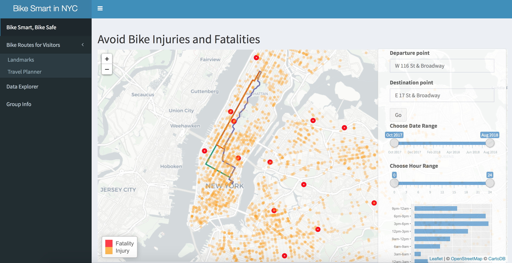

# Project 2: Shiny App Development Version 2.0


In this second project of GR5243 Applied Data Science, we develop a version 2.0 of an *Exploratory Data Analysis and Visualization* shiny app on Citi Bike Data using [Citi Bike](https://data.cityofnewyork.us/NYC-BigApps/Citi-Bike-System-Data/vsnr-94wk) and [Bike Injury Data](http://www.nyc.gov/html/dot/html/about/vz_datafeeds.shtml)

The app is available here: link

## Project Title:   :bike::bike:  Citi Bike Instruction For NYC Travelers  :bike::bike:
Term: Spring 2018

+ Team :bicyclist: Group 5 
+ **Team members**: 
	+ :beers: Xiaojing Dong
	+ :cocktail: Samuel Kolins
	+ :beer: Shaolong Lin
	+ :tea:Yimeng Qiu
	+ :tropical_drink:Jiaming Yan

+ **Project summary**: 


Citi Bike succeeds on so many levels - environmental, health, efficiency. It also becomes a popular transportation way for tourists who visit NYC, a fun and affordable way to get around town. There are 12,000 bikes, 750 stations and 60 neighborhoods in New York, which means people can find a bike and ride away at nearly every block and every street. However, cycling injuries are what bikers all want to avoid. 
- Our app can locate those high bike injury area so people can choose to detour those routes. 
- Furthermore, considering huge volume of NYC tourists every year, our app also finds the most popular bike route for tourists to visit the Empire State Building, Wall Street or whatever places they want to go by bike.

The **Purpose of Design** for this app is 
- :strawberry: help bikers locate high injury area and avoid bicycle crashes
- :watermelon: help tourists find the best route to visit NYC
- :banana: explore interesting facts of Citi Bike


**Contribution statement**: ([default](doc/a_note_on_contributions.md)) All team members contributed equally in all stages of this project. All team members approve our work presented in this GitHub repository including this contributions statement. 

+ Xiaojing Dong: created the 'Bike Smart, Bike Safe' section and the overall structure of the shiny app
+ Samuel Kolins: generated the network graph
+ Shaolong Lin: created the 'Travel Planner' section and the overall structure of the shiny app
+ Yimeng Qiu: created the EDA part of Citi Bike, presenter 
+ Jiaming Yan: created the 'Landmarks' page 


Following [suggestions](http://nicercode.github.io/blog/2013-04-05-projects/) by [RICH FITZJOHN](http://nicercode.github.io/about/#Team) (@richfitz). This folder is orgarnized as follows.


```
proj/
├── app/
├── lib/
├── data/
├── doc/
└── output/
```

Please see each subfolder for a README file.

